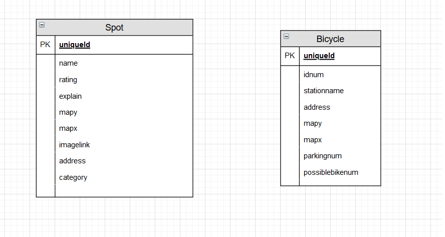
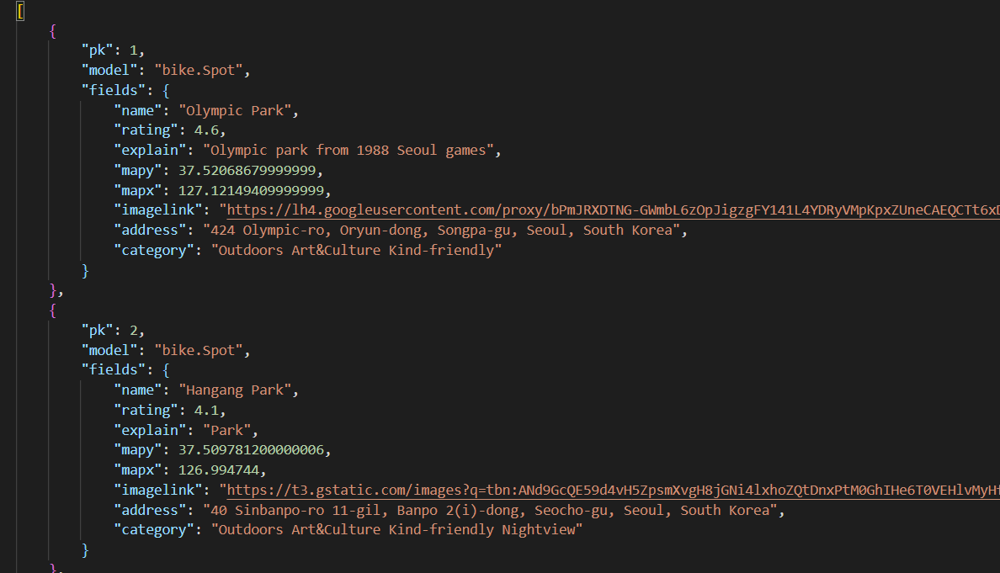
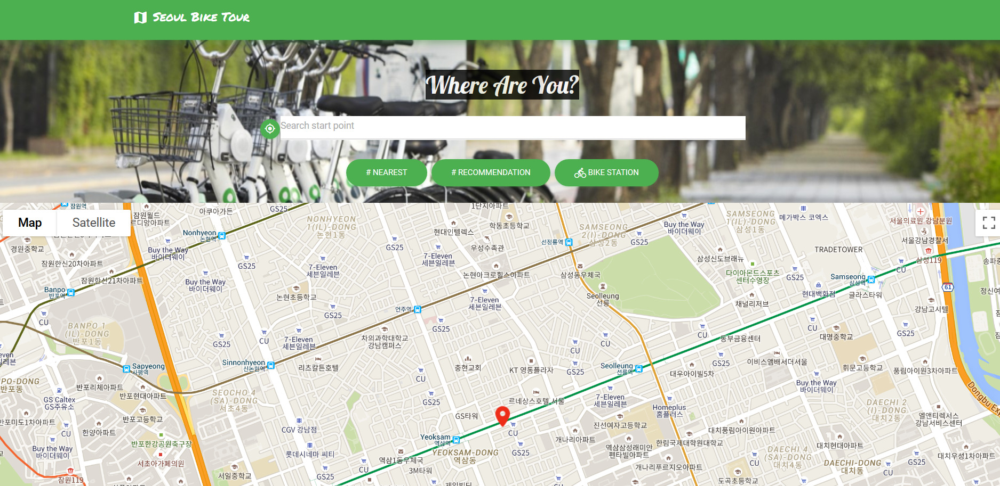
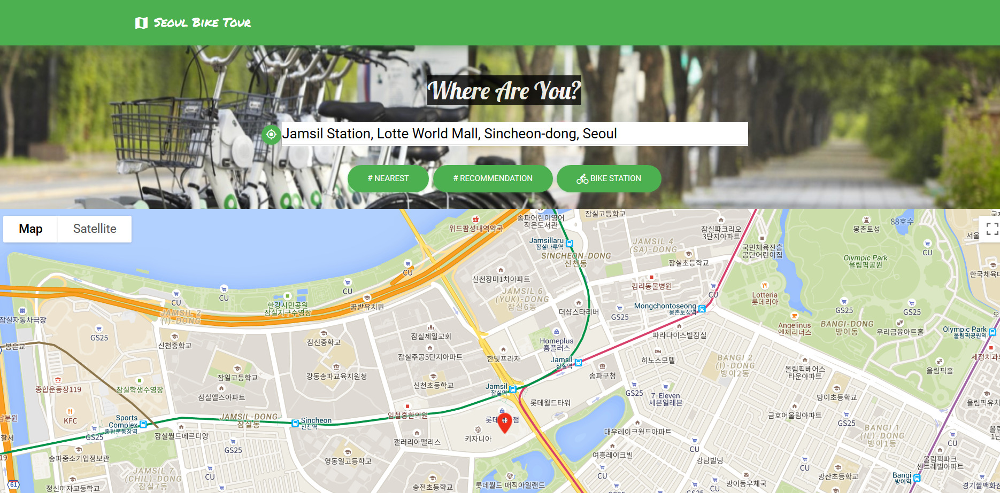
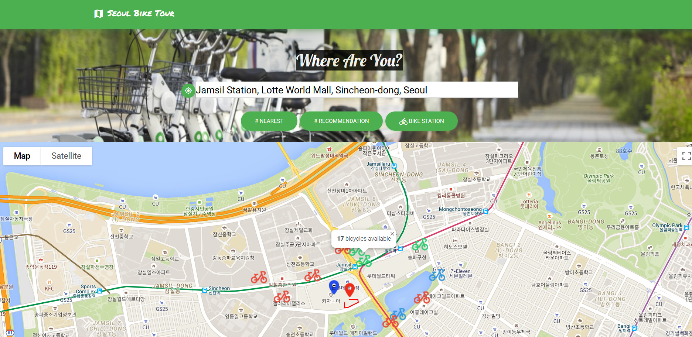
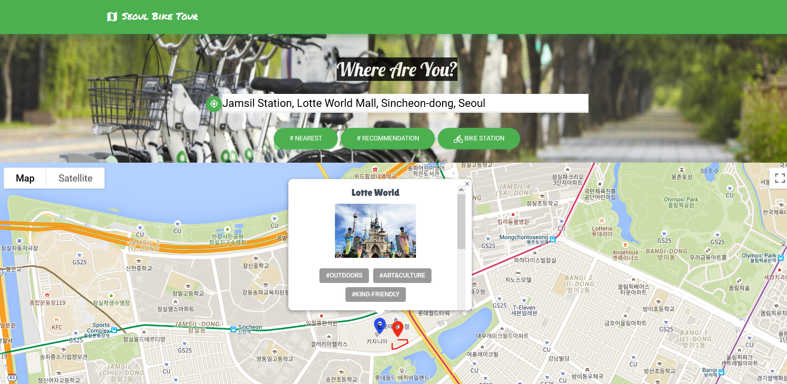
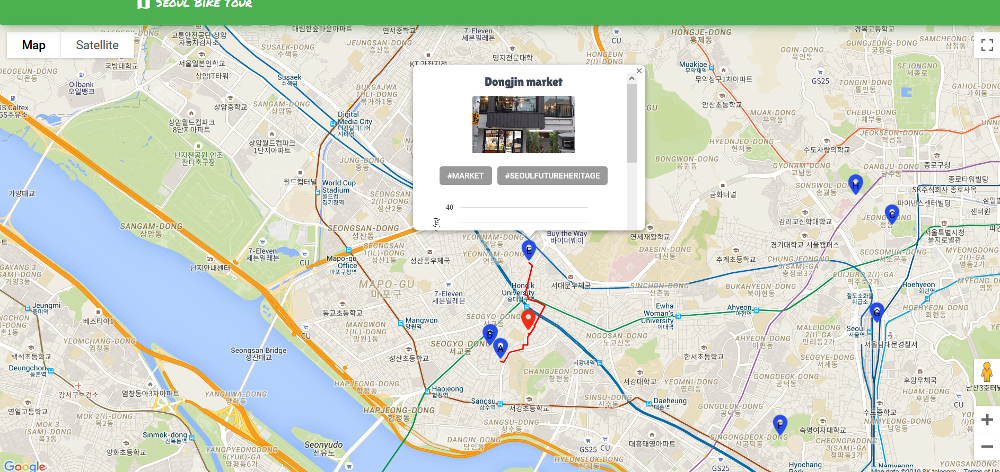
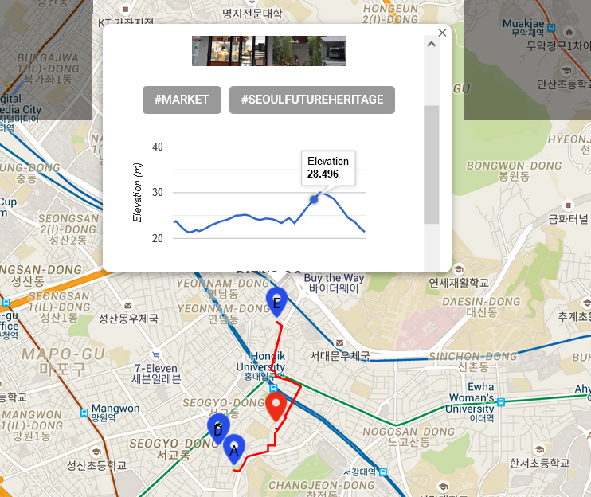

#  Project: 따릉이 투어


**따릉이 투어 기획 배경**

> 현재 서울시에서는 2023년까지 5000만 관광객이 찾는 세계 관광도시로 발돋움하기 위해서 서울관광중기발전 계획을 실행 중이며 다양한 관광 콘텐츠 마련에 힘쓰고 있습니다. 또한, 한국관광공사는 외국인 자전거 관광객 연 3000명을 달성 목표로 국내 자전거 여행 인프라, 플랫폼 개선을 위해 주력하고 있습니다. 이에, 서울시와 한국관광공사 계획에 학생으로서 기여할 수 있는 부분이 무엇이 있을 까 고민했고, 이미 서울 곳곳에 대여소가 존재하는 서울시설공단의 따릉이로 자전거 투어를 할 수 있도록 돕는 웹플랫폼을 기획해보자는 결론에 이르게 되었습니다. 그리고 서울 내 관광지를 서울미래유산, 시간과 결합한 관광지로 카테고리화 하여 외국인 관광객에게 서울 관광지에 대한 자세한 정보를 보여주자는 세부 기획을 하였습니다.


**따릉이 투어 간단 요약**

서울을 방문한 외국인 관광객이 따릉이를 이용해 여행을 할 수 있도록 돕는 관광지추천 지도 웹서비스

- **URL** : https://intense-savannah-70143.herokuapp.com/


결과 ㅣ 서울 디지털 재단, 서울 시설 공단 주관 "스마트시티즌챌린지" `우수상` 수상

## Role

**정의진**

- `algorithm`: 도착지 주변 따릉이 대여소 갯수, 도착지와 주변 따릉이 대여소 거리 기반으로 관광지 추천
- `back-end[restful API]`
  - views.py:  서울 공공데이터 API를 바탕으로 따릉이 대여소 위치 정보, 실시간 잔여 따릉이 대수 data 수집
- `front-end`
  - google map API 활용 auto searchbar 구현
  - 출발지 주변 800m 이내 따릉이 대여소 위치, 실시간 잔여 따릉이 대수를 보여주는 기능 구현

**김현지**

* `data 수집/분류` 
  * 수집 : google things to do in seoul 크롤링, intagram hashtag기반 크롤링, seoul future heritage spots 수집, 구글 API 사용 관광지 gps 수집/변환
  * 분류 : 포털사이트 관광지 연관검색어 결과, 서울미래유산 목록 기반으로 카테고리별 분류
* `algorithm` : 출발지-도착지간 상대적 거리 계산, 구글 평점 높은 순으로 관광지 추천
* `front-end`
  * 현재위치찾기 구현
  * `restful API` JS로 받아오기
  * `jQuery` : `ajax`로 tmap 경로 Api 받아오기(post 형태)
  * HTML/CSS


## Developing


### 1. 개발환경

- Python Web Framework
  - Django 3.0
  - python 3.7.x
- 개발 아키텍처
  - django
  - VanillaJS
  - jquery 2.2.1
- 배포 
  - heroku
  - db: SQLite3
- 협업 환경
  - git
  - trello


### 2. 사용 data 및 API


- 사용 data
  - google things to do in seoul [eng]
  - instagram hashtag
  - seoul city - seoul future heritage tourspots
  - 따릉이 station GPS, 서울시설공단의 따릉이 이용 내역
  - naver, google news, related searches
- 사용 API
  - google map API
  - tmap API
  - 따릉이 API
  - naver search API


#### ※ google map API와 Tmap API를 사용한 이유

> user에게 더 편리하고 직관적인 여행지도를 사용하기 위해서 다양한 API로 map을 구현하였습니다.


##### 1. daum map API

	- 장점 ㅣ 특정 위치에서 특정 범위 내 data 검색이 용이
	- 단점 | 경로는 API로 제공하지 않음, 지도를 영어로 제공하지 않음

##### 2. tmap API

- 장점 | 출발지-도착지 경로를 자세하게 제공, 지도를 영어로 제공
- 단점 | 출발지-도착지간 경사도를 계산할 수 없음, 지역 검색시 영어로 검색이 안됨

##### 3. google map API

- 장점 | 출발지-도착지간 경사도를 제공, 지도를 영어로 제공, 지역 검색시 영어로 검색 가능

- 단점 | 국내법상 경로 제공이 되지 않음

  

>> 모든 지도 API가 장단점을 가지고 있었습니다. 이에 지도 API를 한개만 사용하는 것은 무리라고 판단하였습니다. 이에, Google Map이 경로가 제공되지 않는다는 것 외에 가장 많은 라이브러리를 제공하고 있었기 때문에 Google Map 위에 Tmap API로 구한 경로를 보여주는 방법을 택했습니다.


### 3. 다이어그램 모델 구상도







## 기능


### 1단계: 출발지 선정


#### i. 현재 위치 기반

```js
  function startMap() {
        if (navigator.geolocation) {
            navigator.geolocation.getCurrentPosition(function (pos) {
                initGooglemap(pos.coords.longitude, pos.coords.latitude);
            })
        } else {
            console.log("this browser not supporting Geolocation, start point will be 'seoul city hall'")
            initGooglemap(126.9779, 37.5663)
        }
    }
```




#### ii. 검색 위치 기반




### 2단계: 출발지 주변 따릉이 대여소 위치, 잔여 따릉이 대수

```python
bike_locations = Bicycle.objects.all()
# 실시간 대신 여기에서 처리해주는 것으로 하자.
url = 'http://openapi.seoul.go.kr:8088/' + config("SEOULBIKEKEY") 
dataurl1 = '/json/bikeList/1/1000/'
dataurl2 = '/json/bikeList/1001/2000/'
res = requests.get(url+dataurl1)
temp = res.json().get('rentBikeStatus').get('row')
for t in temp:
    possibleBike = t.get('parkingBikeTotCnt')
    stationName = t.get('stationName')
    stationId = stationName.split('.')[0]
    bikeLoc = bike_locations.get(idnum=stationId)
    bikeLoc.possiblebikenum = possibleBike
    bikeLoc.save()
```




유저들이 직관적으로 따릉이 잔여 대수를 알 수 있도록

 잔여 따릉이 대수 7대 이상이면 `초록색`

 잔여 따릉이 대수 4대 이상 6대 이하면 `파란색`

 잔여 따릉이 대수 3대 이하면 `빨간색`으로 자전거 마커를 표시했습니다.


### 3단계 : 관광지 추천


#### 가장 가까운 관광지 추천

- 코드 구현시 고민했던 점: 지구는 타원이기 때문에 정확한 거리계산을 위해서는 좌표계산해서는 안된다고 판단했습니다.

```js
function haversine_distance(mk1_lat, mk1_lng, mk2_lat, mk2_lng) {
        //var R = 3958.8; // Radius of the Earth in miles
        var R = 6371.0710 // in kilometer
        //var rlat1 = mk1.position.lat() * (Math.PI / 180); // Convert degrees to radians
        //var rlat2 = mk2.position.lat() * (Math.PI / 180); // Convert degrees to radians
        var rlat1 = mk1_lat * (Math.PI / 180)
        var rlat2 = mk2_lat * (Math.PI / 180)
        var difflat = rlat2 - rlat1; // Radian difference (latitudes)
        //var difflon = (mk2.position.lng() - mk1.position.lng()) * (Math.PI / 180); // Radian difference (longitudes)
        var difflon = (mk2_lng - mk1_lng) * (Math.PI / 180); // Radian difference (longitudes)
        var d = 2 * R * Math.asin(Math.sqrt(Math.sin(difflat / 2) * Math.sin(difflat / 2) + Math.cos(rlat1) * Math.cos(rlat2) * Math.sin(difflon / 2) * Math.sin(difflon / 2)));
        return d;
    }
```

해당 코드로 지구가 타원인 것을 반영한 거리 계산을 진행했습니다.





#### RECOMMENDATION 기반 관광지 추천


* 1. 출발지-도착지간 거리 계산 – 거리가  가까운 순서대로 등수 매겨서 1-10등급까지 나눔. 1등급이 제일 가까움, 자전거로 가기 너무 멀면 10등급

  2. 구글 평점 : 0-5점으로 매겨짐 - 0.5 단위로 10등급화

  3. 도착지 주변에 따릉이 대여소가 도보 10분이내에 많은지 여부 - 도착지 주변 따릉이 반납소가 많으면 따릉이로 자전거 여행하기 용이하고, 따릉이 고객 게시판 봤는데 도보 10분 이내로 대여소 설치 요구가 많았기에 도보 10분이내로 기준을 잡았습니다.

     

* 기준 별로 각각 1-10까지 등급화한 후 평균을 냈습니다. 등급이 낮을수록 추천 순위 높아짐. 그래서 A< B< C< D 순으로 총 10개의 관광지 추천




### 4단계: 관광지 정보

- 관광지의 카테고리 : 서울미래유산인지, 어떤 시간에 가면 좋은지, OUTDOOR인지 등

- 출발지-도착지까지의 경사도 : 현 출발지에서 도착지까지 자전거 여행자가 자전거 여행하기 안전한지 경사도를 보여줌. 이 데이터는 출발지가 바뀔때마다, 동적으로 변화합니다.




## 기술 구현하면서 어려웠던 점


### 1. CORS 오류


- 문제: https 에서는 http를 axios, ajax로 호출하지 못하는 어려움

  >  아직까지도 많은 공공기관의 데이터(공공데이터)들은 http로 제공되는 경우가 많았습니다. 
  >
  > 하지만, 오늘날 대부분의 브라우저는 보안을 강화한 https로 사이트를 접속할 수 있게 하기 때문에 https에서 http 데이터를 가져오는 것은 보안상 안전하지 않다며 막아놓는 경우가 많습니다. 저희가 겪었던 오류도 그러한 일환 중 하나였습니다.

- 해결 : javascript에서 axios, ajax를 http로 호출하는 대신 django 서버에서 직접 API 호출한 뒤에 해당 http url json 정보 저장.

변경전 코드

```js
let bikeLocationsBySeoul = []
        axios.get('http://openapi.seoul.go.kr:8088/{{ seoulbikekey }}/json/bikeList/1/1000/')
            .then(function (response) {
                bikeLocationsBySeoul.push(response.data.rentBikeStatus.row)
                axios.get('http://openapi.seoul.go.kr:8088/{{ seoulbikekey }}/json/bi
```


변경후 코드

```python
 url = 'http://openapi.seoul.go.kr:8088/' + config("SEOULBIKEKEY") 
    dataurl1 = '/json/bikeList/1/1000/'
    dataurl2 = '/json/bikeList/1001/2000/'
    res = requests.get(url+dataurl1)
    temp = res.json().get('rentBikeStatus').get('row')
    for t in temp:
        possibleBike = t.get('parkingBikeTotCnt')
        stationName = t.get('stationName')
        stationId = stationName.split('.')[0]
        bikeLoc = bike_locations.get(idnum=stationId)
        bikeLoc.possiblebikenum = possibleBike
        bikeLoc.save()
```

